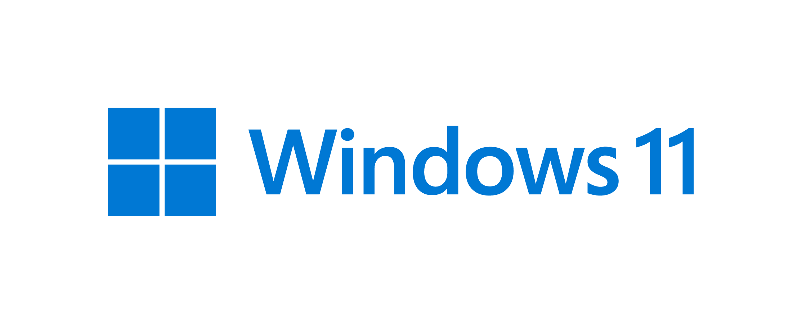
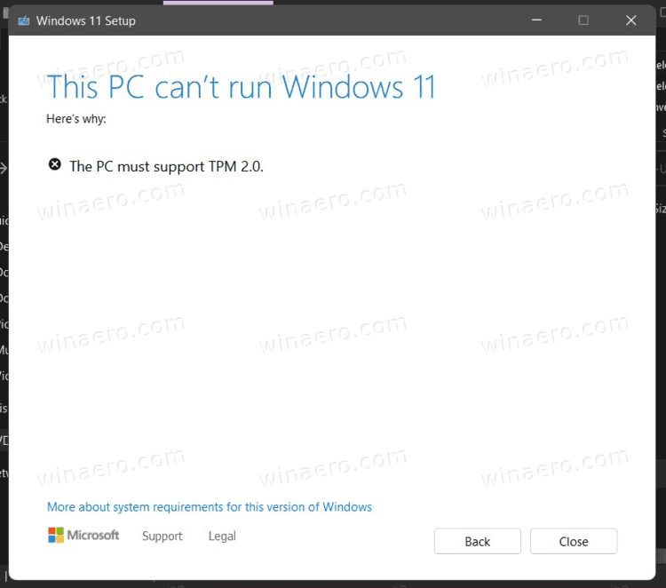
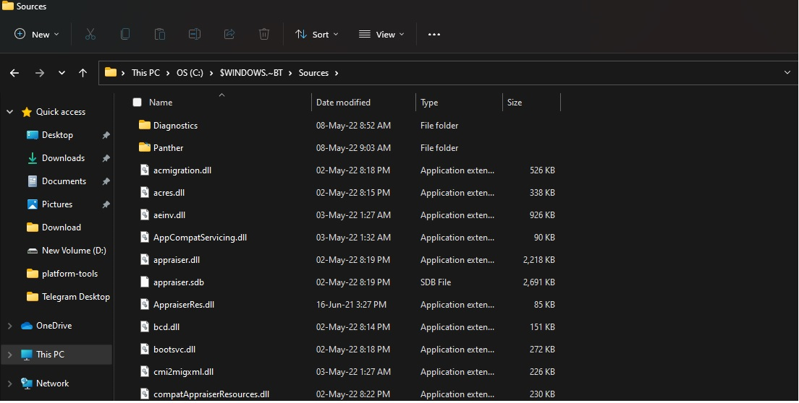

# Windows 11 Bypass #
<p align="center">
  
</p>

--------------------------------------------------------------------------
Windows 11 for Everyone! , Bypass TPM/SoC checks and install Windows 11 safely on your unsupported device.

## About ##
* Starting with Windows 11, Microsoft made several requirements necessary to "officially" upgrade or install Windows 11, some of requirements are :- 
     - TPM >= 2.0 ( https://www.microsoft.com/en-us/windows/windows-11-specifications?r=1#:~:text=1%20gigahertz%20(GHz)%20or%20faster,on%20a%20Chip%20(SoC).&text=4%20gigabyte%20(GB).&text=64%20GB%20or%20larger%20storage,%2Ddate%E2%80%9D%20for%20more%20details.&text=UEFI%2C%20Secure%20Boot%20capable. )
     - Intel Core 8 Generation or above ( https://docs.microsoft.com/en-us/windows-hardware/design/minimum/supported/windows-11-supported-intel-processors )
     - AMD ( https://docs.microsoft.com/en-us/windows-hardware/design/minimum/supported/windows-11-supported-amd-processors )
     
* Hence due to these limitations, even high end, older Generation Laptops/PCs were not able to get taste of Windows 11, some other ways required a clean install or a modded ISO
  which everyone does not prefer.
  
* This repo will help you Bypass Win11 checks, and install windows 11 officially via Media Creation Tool or Windows Update without loosing data/using a modded ISO.

## How to use ##
* Download ```appraiserres.dll``` from this repo or head to releases and download latest release.
* Download Windows Media Creation Tool or head over to Windows Update
           - For Media Creation Tool, Visit this page https://www.microsoft.com/software-download/windows11
           - And Click on Download under "Create Windows 11 Installation Media" Option
           - Run ```MediaCreationToolW11.exe```
* Now, let Windows Update/Tool Download Windows 11, Upon reaching 8% Download it'll stop and following error will be displayed.
<p align="center">
  
</p>
 
* Now, head to C:\ and enable "Show hidden folder options" , you'll see a folder named ```$WINDOWS.~BT``` open it and head to dir ```C:\$WINDOWS.~BT\Sources```
* Replace ```appraiserres.dll``` in the folder from the one you download from this repo
<p align="center">
  
</p>
 
* And Boom, Re-run update !
* Wait for Windows Update/Media Creation Tool to Download and Install Windows 11 for you!

## Credits ##
* Microsoft for ```appraiserres.dll``` binary (from W10), Media Creation Tool and everything
* Reddit/Telegram where I learnt to bypass Win11 checks in July '21


## Notes ##
* This method is tested on Windows 10 v2004 > Windows 11 v21H2
* Hence it should ideally work on Windows 11 v21H2/Windows 10 21H2 > Windows 11 v22H2 
* Will this work on future Windows 11 Updates? Yes, Until Microsoft Patches it.
* Leave a Star if this repo works for you!

